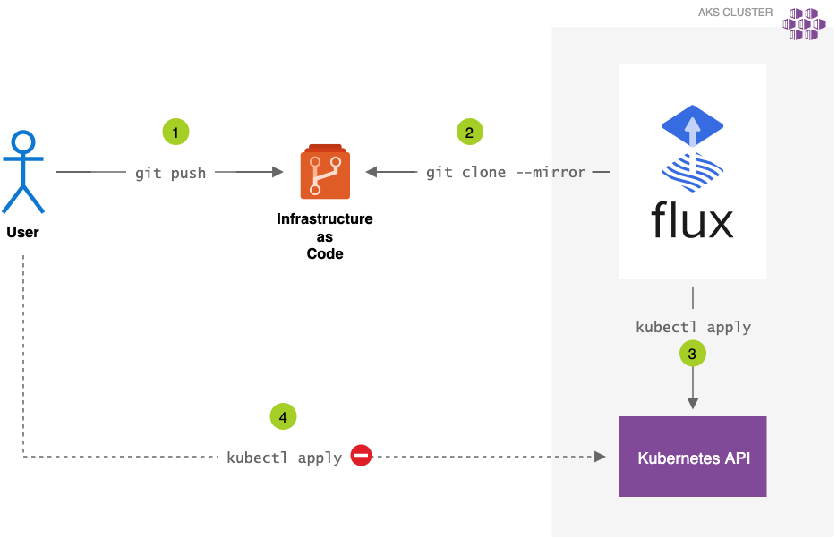
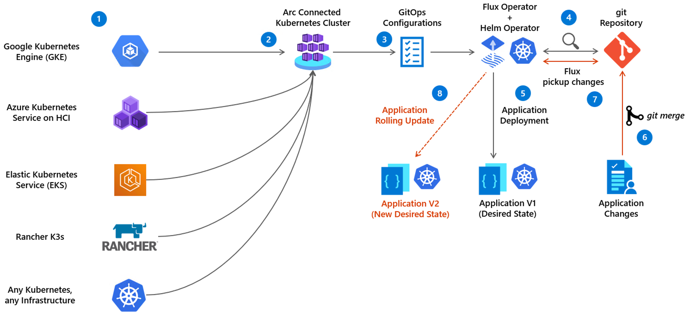
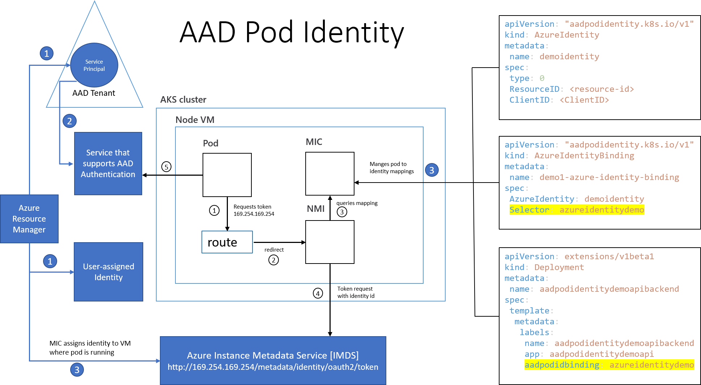
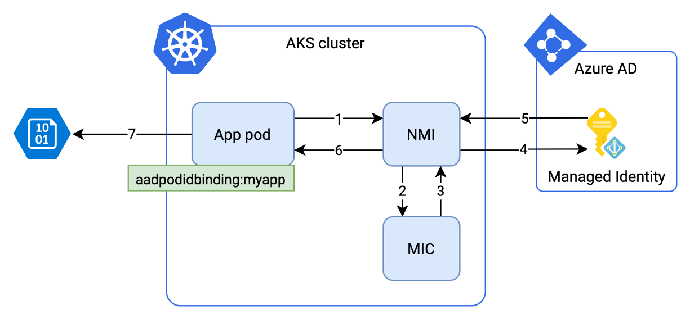
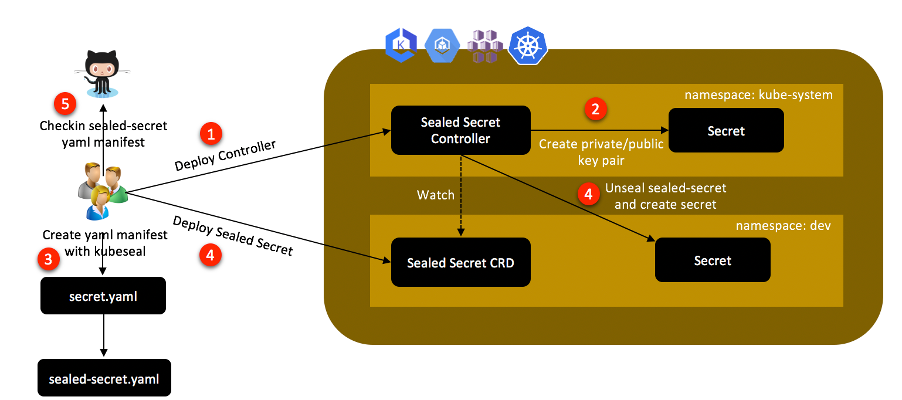

# Kubernetes on Edge Validation

The purpose of this project is to validate certain technologies and patterns using an Azure Arc enabled Cluster. 

Github Code Spaces is used as the environment to perform the validations and provide an easy place to learn.


## Prepare a Subscription

Configure a subscription with the features and providers necessary with cli extensions loaded.


```bash
# Azure CLI Login
az login
az account set --subscription <your_subscription>

# Enable Preview Features (one time action)
az feature register --name EnablePodIdentityPreview --namespace Microsoft.ContainerService
az feature show --name EnablePodIdentityPreview --namespace Microsoft.ContainerService

# Register Providers (one time action)
az provider register --namespace Microsoft.Kubernetes
az provider register --namespace Microsoft.KubernetesConfiguration
az provider register --namespace Microsoft.ExtendedLocation
az provider register --namespace Microsoft.ContainerService

# Show Providers  (one time action)
az provider show -n Microsoft.Kubernetes -o table
az provider show -n Microsoft.KubernetesConfiguration -o table
az provider show -n Microsoft.ExtendedLocation -o table

# Add CLI Extensions
az extension add --name aks-preview
az extension add --name connectedk8s
az extension add --name k8s-configuration
az extension add --name k8s-extension
az extension add --name customlocation
```

## Setup an Azure Kubernetes Instance for reference validation

A public cloud AKS instance is used as a reference point to understand how things are done on AKS which is compared to an ARC enabled Cluster. 

[User Managed Identities](https://docs.microsoft.com/en-us/azure/aks/use-managed-identity) will be used in the creation of this AKS instance.

[Pod Managed Identities](https://docs.microsoft.com/en-us/azure/aks/use-azure-ad-pod-identity) is a preview feature used to easily manage the primatives that allow pods to access Azure resources.


```bash
RESOURCE_GROUP="azure-k8s"
LOCATION="eastus"

# Create a Resource Group
az group create -n $RESOURCE_GROUP -l $LOCATION

# Create a Control Plane Identity
IDENTITY_NAME="aks-controlplane-identity"
az identity create -n $IDENTITY_NAME -g $RESOURCE_GROUP -l $LOCATION
IDENTITY_ID=$(az identity show -n $IDENTITY_NAME -g $RESOURCE_GROUP -o tsv --query "id")

# Create a Kubelet Identity
KUBELET_IDENTITY_NAME="aks-kubelet-identity"
az identity create -n $KUBELET_IDENTITY_NAME -g $RESOURCE_GROUP -l $LOCATION
KUBELET_IDENTITY_ID=$(az identity show -n $KUBELET_IDENTITY_NAME -g $RESOURCE_GROUP -o tsv --query "id")
KUBELET_IDENTITY_OID=$(az identity show -n $KUBELET_IDENTITY_NAME -g $RESOURCE_GROUP -o tsv --query "principalId")

# Create a Cluster
AKS_NAME="azure-k8s"
az aks create -g $RESOURCE_GROUP -n $AKS_NAME --enable-managed-identity --assign-identity $IDENTITY_ID --assign-kubelet-identity $KUBELET_IDENTITY_ID --generate-ssh-keys

# Get the Credentials
az aks get-credentials -g $RESOURCE_GROUP -n $AKS_NAME

# Validate the Cluster
kubectl cluster-info --context $AKS_NAME

# Configure a Kubelet "Virtual Machine Contributor" role
RESOURCE_GROUP_ID=$(az group show -n $RESOURCE_GROUP -o tsv --query id)
AKS_RESOURCE_GROUP_NAME=$(az aks show -g $RESOURCE_GROUP -n $AKS_NAME -o tsv --query nodeResourceGroup)
AKS_RESOURCE_GROUP_ID=$(az group show -n $AKS_RESOURCE_GROUP_NAME -o tsv --query id)
KUBELET_CLIENT_ID=$(az aks show -g $RESOURCE_GROUP -n $AKS_NAME -o tsv --query identityProfile.kubeletidentity.clientId)
az role assignment create --role "Virtual Machine Contributor" --assignee $KUBELET_CLIENT_ID --scope $AKS_RESOURCE_GROUP_ID
```


## Setup an ARC Enabled Kubernetes Instance for validation

In an attempt to make things easy for the purpose of simple validations a `kind` kubernetes cluster will be used hosted in Github Code Spaces.

[Github Code Spaces](https://docs.github.com/en/codespaces) is an online development environment hosted by Github and powered by Visual Studio Code.

[Kubernetes-sigs/kind](https://github.com/kubernetes-sigs/kind) is a tool for running local Kubernetes clusters using Docker container "nodes".


```bash
# Using kind create a Kubernetes Cluster
kind create cluster

# Arc enable the Kubernetes Cluster
ARC_AKS_NAME="kind-k8s"
az connectedk8s connect -n $ARC_AKS_NAME -g $RESOURCE_GROUP

# Validate ARC agents
kubectl cluster-info --context kind-kind
kubectl get pods -n azure-arc
```

## Validation - Gitops

**Technical Links**

[Flux](https://fluxcd.io/docs/) is a tool for keeping Kubernetes clusters in sync with sources of configuration.

[GitOps Configurations](https://docs.microsoft.com/en-us/azure/azure-arc/kubernetes/conceptual-configurations) is a microsoft managed method for enabling GitOps practices on an ARC enabled Cluster.


**Options**

1. Unmanaged Flux Configuration

    [Instructions](./docs/gitops-management/FluxSetup.md)

        [X] AKS Cloud
        [X] ARC Enabled AKS

        Notes
        ----------------
        1. This leverages kustomizations controllers with a single source of truth Git Repository for the cluster.





2. Managed Flux with ARC Enabled Kubernetes Gitops Configuration

    [Instructions](./docs/gitops-management/FluxSetup.md)

        [X] ARC Enabled AKS

        Notes
        ----------------
        1. This is a feature only available to an ARC Enabled Cluster.
        2. Removes the need to configure flux on the server as ARC manages the flux setup.




## Validation - Identity Management

**Technical Links**

- [AAD Pod Identity](https://docs.microsoft.com/en-us/azure/aks/use-azure-ad-pod-identity)


**Options**

1. User Managed Identity with AAD Pod Identity

Azure AKS leverages AAD Pod Identity to allow a managed identity to access Azure Resources in a secure manner.  This feature is being built into the AKS experience as a first class citizen instead of a configured option.

    [Process Documentation]()

        [X] AKS Cloud

        Questions Raised
        ----------------
        1. User Managed Identity doesn't exist on ARC Enabled AKS can AAD Pod Identity still be used?



2. System Assigned Identity

    [Process Documentation]()

        [ ] AKS Cloud
        [ ] ARC Enabled AKS

        Questions Raised
        ----------------
        1. ARC Clusters can only leverage a System Assigned Identity.  Is the meta API still available to be called and how?

TODO:// Document and validate how System Assigned Identities can be used in ARC enabled Kubernetes




## Validation - Secret Management

This validation requires an Azure Key Vault to be provisioned.

### Setup Azure KeyVault

```bash
VAULT_NAME="azure-k8s-vault"
RESOURCE_GROUP="azure-k8s"
LOCATION="eastus"

# Create Key Vault
az keyvault create --name $VAULT_NAME --resource-group $RESOURCE_GROUP --location $LOCATION

# Create a Cryptographic Key
az keyvault key create --name sops-key --vault-name $VAULT_NAME --protection software --ops encrypt decrypt

# Create a User Managed Identity
KV_IDENTITY_NAME="kv-access-identity"
az identity create -n $KV_IDENTITY_NAME -g $RESOURCE_GROUP -l $LOCATION
KV_IDENTITY_OID=$(az identity show -n $KV_IDENTITY_NAME -g $RESOURCE_GROUP -o tsv --query "principalId")
KV_IDENTITY_ID=$(az identity show -n $KV_IDENTITY_NAME -g $RESOURCE_GROUP -o tsv --query "id")

# Add Access Policy for Managed Identity
az keyvault set-policy --name $VAULT_NAME --resource-group $RESOURCE_GROUP --object-id $KV_IDENTITY_OID --key-permissions encrypt decrypt
```

**Technical Links**
- [Tech Blog](https://techcommunity.microsoft.com/t5/azure-global/gitops-and-secret-management-with-aks-flux-cd-sops-and-azure-key/ba-p/2280068)
- [Managing Secrets Blog](https://dzone.com/articles/managing-kubernetes-secrets)
- [Azure Arc Blog](https://www.cloudwithchris.com/blog/azure-arc-for-apps-part-1/)

**Options**

1. Bitnami's [Sealed Secrets](https://github.com/bitnami-labs/sealed-secrets)

    Sealed Secrets require an additional controller and a new SealedSecret CRD that is safe to store in a Git Repository.  After flux applies the SealedSecret object, the controller decrypts the sealed secret and applies the plain secrets.

    [Instruction Documentation]()

        [ ] AKS Cloud
        [ ] ARC Enabled AKS

        Questions Raised
        ----------------




2. Mozilla's [SOPS](https://github.com/mozilla/sops)

    Unlike Sealed Secrets, SOPS does not require any additional controller because Flux's kustomize-controller can perform the decryption of the secrets. SOPS has integration with Azure Key Vault to store the cryptographic used to encrypt and decrypt the secrets. Access to Key Vault is performed with an Azure Identity.

    [Instruction Documentation](./docs/4.MozilaSops.md)

        [X] AKS Cloud
        [ ] ARC Enabled AKS

        Questions Raised
        ----------------
        1. Can a system assigned identity be used on Arc Enabled Kubernetes to access Key Vault?


3. Azure Key Vault Provider for Secrets Store [CSI Driver](https://github.com/Azure/secrets-store-csi-driver-provider-azure)

This approach allows us to define our secrets in Key Vault and automatically make them available as Kubernetes secrets.
This option might be seen as breaking the GitOps workflow where the Git repository is the single source of truth for application desired state.

**!** This method is the method used for OSDU on Azure.

[ ] Validate this method.


4. Azure Key Vault to Kubernetes [(akv2k8s)](https://akv2k8s.io/)

This makes Azure Key Vault secrets, certificates and keys available in Kubernetes in a simple secure way leveraging the 12 Factor App principals and includes a controller pattern as well as an injector pattern.


[ ] Validate this method.