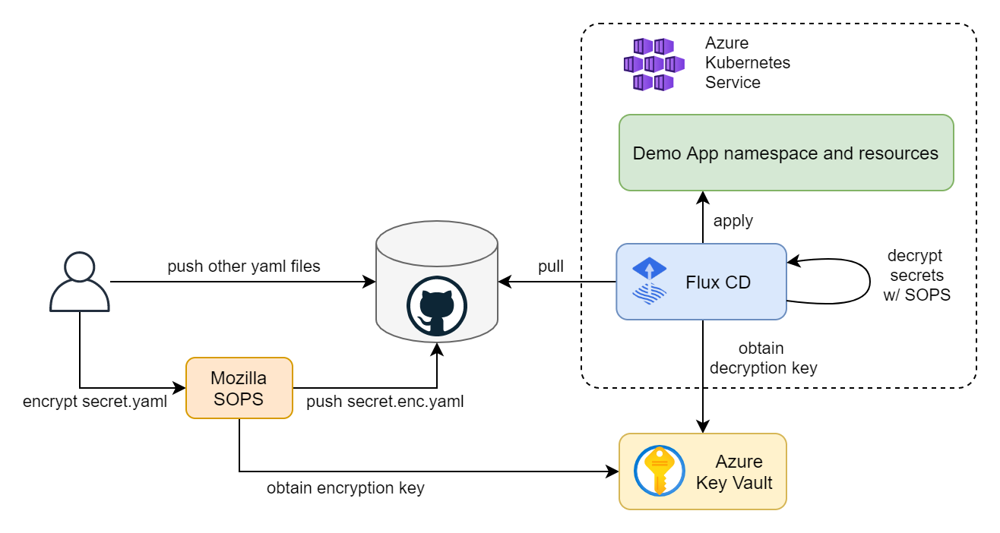
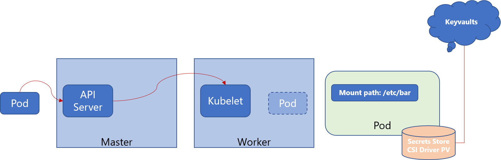
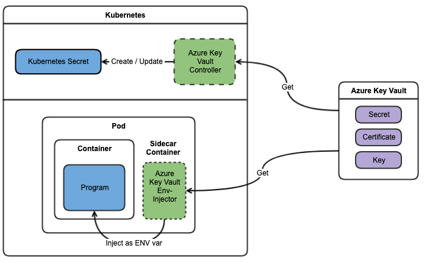

# Kubernetes on Edge Validation

The purpose of this project is to validate certain technologies and patterns using an Azure Arc enabled Cluster. 

Github Code Spaces is used as the environment to perform the validations and provide an easy place to learn.


## Prepare a Subscription

Configure a subscription with the features and providers necessary with cli extensions loaded.


```bash
# Azure CLI Login
az login
az account set --subscription <your_subscription>

# Enable Preview Features (one time action)
az feature register --name EnablePodIdentityPreview --namespace Microsoft.ContainerService
az feature register --namespace Microsoft.ContainerService --name AKS-AzureKeyVaultSecretsProvider
az feature show --name EnablePodIdentityPreview --namespace Microsoft.ContainerService
az feature show --name AKS-AzureKeyVaultSecretsProvider --namespace Microsoft.ContainerService

# Register Providers (one time action)
az provider register --namespace Microsoft.Kubernetes
az provider register --namespace Microsoft.KubernetesConfiguration
az provider register --namespace Microsoft.ExtendedLocation
az provider register --namespace Microsoft.ContainerService

# Show Providers  (one time action)
az provider show -n Microsoft.Kubernetes -o table
az provider show -n Microsoft.KubernetesConfiguration -o table
az provider show -n Microsoft.ExtendedLocation -o table

# Add CLI Extensions
az extension add --name aks-preview
az extension add --name connectedk8s
az extension add --name k8s-configuration
az extension add --name k8s-extension
az extension add --name customlocation
```

## Setup an Azure Kubernetes Instance for reference validation

A public cloud AKS instance is used as a reference point to understand how things are done on AKS which is compared to an ARC enabled Cluster. 

[User Managed Identities](https://docs.microsoft.com/en-us/azure/aks/use-managed-identity) will be used in the creation of this AKS instance.


```bash
RESOURCE_GROUP="azure-k8s"
LOCATION="eastus"

# Create a Resource Group
az group create -n $RESOURCE_GROUP -l $LOCATION

# Create a Control Plane Identity
IDENTITY_NAME="aks-controlplane-identity"
az identity create -n $IDENTITY_NAME -g $RESOURCE_GROUP -l $LOCATION
IDENTITY_ID=$(az identity show -n $IDENTITY_NAME -g $RESOURCE_GROUP -o tsv --query "id")

# Create a Cluster 
AKS_NAME="azure-k8s"
az aks create -g $RESOURCE_GROUP -n $AKS_NAME \
    --network-plugin azure \
    --enable-managed-identity  \
    --assign-identity $IDENTITY_ID \
    --generate-ssh-keys

# Get the Credentials
az aks get-credentials -g $RESOURCE_GROUP -n $AKS_NAME

# Validate the Cluster
kubectl cluster-info --context $AKS_NAME

# Assign Kubelet Roles required for AAD Pod Identity
KUBENET_ID="$(az aks show -g ${RESOURCE_GROUP} -n ${AKS_NAME} --query identityProfile.kubeletidentity.clientId -otsv)"
NODE_GROUP=$(az aks show -g ${RESOURCE_GROUP} -n $AKS_NAME --query nodeResourceGroup -o tsv)
NODES_RESOURCE_ID=$(az group show -n $NODE_GROUP -o tsv --query "id")

az role assignment create --role "Managed Identity Operator" --assignee "$KUBENET_ID" --scope $NODES_RESOURCE_ID
az role assignment create --role "Virtual Machine Contributor" --assignee "$KUBENET_ID" --scope $NODES_RESOURCE_ID
```


## Setup an ARC Enabled Kubernetes Instance for validation

To make things easy for the purpose of simple validations a `kind` kubernetes cluster is used and hosted in Github Code Spaces.

[Github Code Spaces](https://docs.github.com/en/codespaces) is an online development environment hosted by Github and powered by Visual Studio Code.

[Kubernetes-sigs/kind](https://github.com/kubernetes-sigs/kind) is a tool for running local Kubernetes clusters using Docker container "nodes".


```bash
# Using kind create a Kubernetes Cluster
ARC_AKS_NAME="kind-k8s"
kind create cluster --name $ARC_AKS_NAME

# Arc enable the Kubernetes Cluster
az connectedk8s connect -n $ARC_AKS_NAME -g $RESOURCE_GROUP

# Validate ARC agents
kubectl cluster-info --context "kind-$ARC_AKS_NAME"
kubectl get pods -n azure-arc
```

## Validation - Gitops

The assumption on Gitops Configurations is that the current repository is being used to manage the cluster.  If starting a new validation it tends to be best to remove the flux configuration for the cluster prior to setting up a new cluster.

```bash
# Remove the flux configurations for the clusters
rm -rf clusters/$AKS_NAME
rm -rf clusters/$ARC_AKS_NAME

# Update the Git Repo
git add ./clusters/ && git commit -m "Removing Flux Configuration" && git push
```

Additionally to uninstall flux from a cluster the following command can be run `flux uninstall`

**Technical Links**

[Flux](https://fluxcd.io/docs/) is a tool for keeping Kubernetes clusters in sync with sources of configuration.

[GitOps Configurations](https://docs.microsoft.com/en-us/azure/azure-arc/kubernetes/conceptual-configurations) is a microsoft managed method for enabling GitOps practices on an ARC enabled Cluster using Flux.


**Option 1 -- Flux Configuration** -- [Configuration Instructions](./docs/gitops_management/FluxSetup.md)

    [X] AKS Cloud
    [X] ARC Enabled AKS

    Notes
    ----------------
    1. This leverages kustomizations controllers with a single source of truth Git Repository for the cluster.
    2. Will work regardless of Azure or Edge.


**Option 2 -- Gitops Configuration Extension** -- [Configuration Instructions](././docs/gitops_management/GitopsConfiguration.md)

    [X] ARC Enabled AKS

    Notes
    ----------------
    1. This is a feature only available to an ARC Enabled Cluster.
    2. Removes the need to configure flux on the server as ARC manages the flux setup.
    3. Utilizes Flux v1 but will be updated to v2.


## Validation - Identity Management

**Technical Links**

- [AAD Pod Identity](https://docs.microsoft.com/en-us/azure/aks/use-azure-ad-pod-identity)


**Options**

1. AAD Pod Identity using MIC

    [Instructions](./docs/identity_management/PodIdentity.md)

        [X] AKS Cloud
        [ ] ARC Enabled AKS

        Notes
        ----------------
        1. This is the common way of configuration for AKS.


2. Managed Pod Identity 

    [Instructions](././docs/identity_management/ManagedPodIdentity.md)

        [X] AKS Cloud

        Notes
        ----------------
        1. This is the coming new way of configuration for AKS with extenions.


3. System Assigned Identity

    [Documentation]()

        [ ] ARC Enabled AKS

        Questions Raised
        ----------------
        1. ARC Clusters can only leverage a System Assigned Identity.  Is the meta API still available to be called and how?

TODO:// Document and validate how System Assigned Identities can be used in ARC enabled Kubernetes


## Validation - Secret Management

This validation requires an Azure Key Vault to be provisioned the following commands will provision a KV and a managed identity.

```bash
VAULT_NAME="azure-k8s-vault"
RESOURCE_GROUP="azure-k8s"
LOCATION="eastus"
kubectl config use-context $AKS_NAME

# Create Key Vault
az keyvault create --name $VAULT_NAME --resource-group $RESOURCE_GROUP --location $LOCATION

# Create a Cryptographic Key
KEY_NAME="sops-key"
az keyvault key create --name $KEY_NAME --vault-name $VAULT_NAME --protection software --ops encrypt decrypt

# Create a Secret
SECRET_NAME="admin"
SECRET_VALUE="t0p-S3cr3t"
az keyvault secret set --name $SECRET_NAME --value $SECRET_VALUE --vault-name $VAULT_NAME

# Create a User Managed Identity
KV_IDENTITY_NAME="kv-access-identity"
az identity create --resource-group ${RESOURCE_GROUP} --name ${KV_IDENTITY_NAME}

# Assign the proper Role
KV_IDENTITY_ID="$(az identity show -g ${RESOURCE_GROUP} -n ${KV_IDENTITY_NAME} --query id -otsv)"
KV_IDENTITY_OID="$(az identity show -g ${RESOURCE_GROUP} -n ${KV_IDENTITY_NAME} --query principalId -otsv)"
KUBENET_ID="$(az aks show -g ${RESOURCE_GROUP} -n ${AKS_NAME} --query identityProfile.kubeletidentity.clientId -otsv)"
az role assignment create --role "Managed Identity Operator" --assignee "$KUBENET_ID" --scope $KV_IDENTITY_ID

# Add Access Policy for Managed Identity
az keyvault set-policy --name $VAULT_NAME --resource-group $RESOURCE_GROUP --object-id $KV_IDENTITY_OID --key-permissions encrypt decrypt get --secret-permissions get --certificate-permissions get
```

**Technical Links**
- [Tech Blog](https://techcommunity.microsoft.com/t5/azure-global/gitops-and-secret-management-with-aks-flux-cd-sops-and-azure-key/ba-p/2280068)
- [Managing Secrets Blog](https://dzone.com/articles/managing-kubernetes-secrets)
- [Azure Arc Blog](https://www.cloudwithchris.com/blog/azure-arc-for-apps-part-1/)

**Options**

1. Bitnami's [Sealed Secrets](https://github.com/bitnami-labs/sealed-secrets)

    Sealed Secrets require an additional controller and a new SealedSecret CRD that is safe to store in a Git Repository.  After flux applies the SealedSecret object, the controller decrypts the sealed secret and applies the plain secrets.

    [Instruction Documentation](./docs/secret_management/sealedsecrets.md)

        [X] AKS Cloud
        [X] ARC Enabled AKS

        Notes
        ----------------
        1. In  order to seal a secret access to the controller by kubectl must exist.


2. Mozilla's [SOPS](https://github.com/mozilla/sops)

    Unlike Sealed Secrets, SOPS does not require any additional controller because Flux's kustomize-controller can perform the decryption of the secrets. SOPS has integration with Azure Key Vault to store the cryptographic used to encrypt and decrypt the secrets. Access to Key Vault is performed with an Azure Identity.

    [Instruction Documentation](./docs/secret_management/SopsSecrets.md)

        [X] AKS Cloud
        [ ] ARC Enabled AKS

        Notes
        ----------------
        1. AAD Identity needs to be configured prior to working secrets this way in order to access the KV.
        1. Can a system assigned identity be used on Arc Enabled Kubernetes to access Key Vault?





3. Azure Key Vault Provider for Secrets Store [CSI Driver](https://github.com/Azure/secrets-store-csi-driver-provider-azure)

    This approach allows us to define our secrets in Key Vault and automatically make them available as Kubernetes secrets.
    This option might be seen as breaking the GitOps workflow where the Git repository is the single source of truth for application desired state.

    **!** This method is the method used for OSDU on Azure.

    [Instruction Documentation](./docs/secret_management/CsiDriver.md)

        [X] AKS Cloud
        [ ] ARC Enabled AKS

        Notes
        ----------------
        1. AKS implementation future method default method would be to enable Pod Identity and KV CSI Driver by native AKS functionality.
        2. Azure CSI Driver 0.0.20 doesn't work with mapped secrets.  Using 0.0.19





4. Azure Key Vault to Kubernetes [(akv2k8s)](https://akv2k8s.io/)

    This makes Azure Key Vault secrets, certificates and keys available in Kubernetes in a simple secure way leveraging the 12 Factor App principals and includes a controller pattern as well as an injector pattern.

    [Instruction Documentation]()

        [ ] AKS Cloud
        [ ] ARC Enabled AKS


